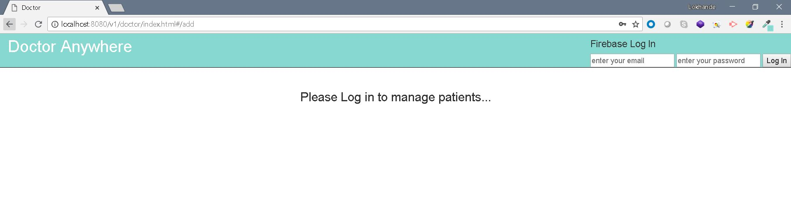
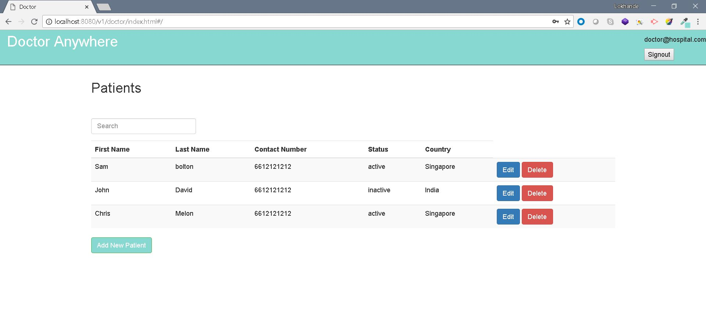
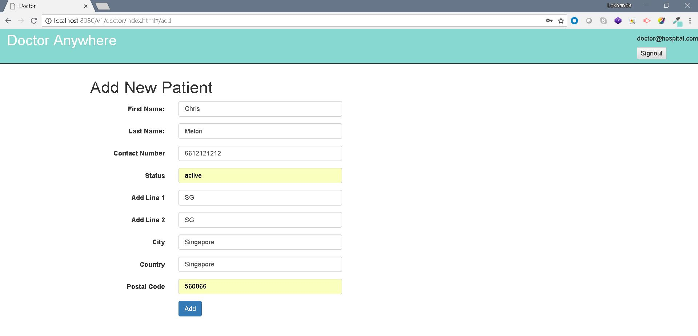

# Create , read , update and delete patient data.

## Tech stack
- Spring Boot  - backend service which exposes REST APi's.
- Angular JS - Frontend client app (interacts with Spring boot services).
- H2 - In memory database.
- Firebase auth.

Email to vishnudas30@gmail.com for login credentails.

## Screenshots

